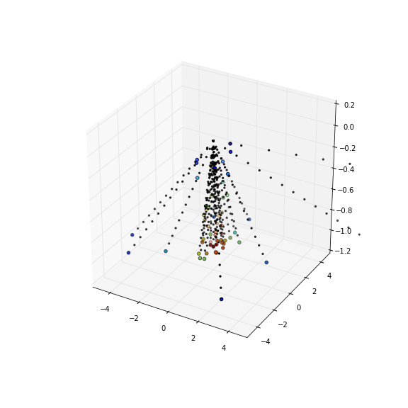

# Ambient Fisher 

* Kyle Cranmer 

Based on discussions with and notes from Jeff Streets at UCI, played with interpolating distributions based on geodesics in the space of distributions. 

Motivates a general algorithm based on pairs ($\alpha_i$, $f_i(x)$) for i=0,...,m where $\alpha_i$ are n-dim parameter vectors and $f_i(x)$ are distributions corresponding to those points. Goal is to create interpolated $f(x|alpha)$ using ambient fisher geodesics.

   * need m at least n+1 to create simplex, for more use Delaunay tesselation

   * n-dim spherical simplex mapped to "gnomonic simplex" via generalization of [gnomonic projection](http://en.wikipedia.org/wiki/Gnomonic_projection) (where great circles / geodsics are straight lines)

   * affine map (easily computed with barycentric coordinates) connects simplex in parameter space with the gnomonic simplex

   * use ambient fisher geodesic in that direction for the appropriate distance computed from the coordinates to arrive at the interpolant f(x|alpha)

Progress

   * ambient-fisher.ipynb - examples of interpolating based on geodesics in the space of distributions. 

   * SphericalMDSTest.ipynb - Here the idea is that we know that the distributions n+1 distributions form the vertices of an n-spherical simplex on the n-sphere. We use the chord distance of the points (2sin(ambient fisher distance)) to build pair-wise distance matrix of those points. From that, we can use MDS to numerically find the explicit coordinates of those points. Then we can perform the gnomonic projection (after rotating the points appropriately). 
   With this we have the gnomonic simplex.

   * BarycentricCoordinates.ipynb - this is a simple example of using [scipy.spatial.Delaunay](http://docs.scipy.org/doc/scipy-0.14.0/reference/generated/scipy.spatial.Delaunay.html) to map from one simplex to another with barycentric coordinates

   * to do is algorithm to take alpha, and produce the interpolant. notebooks above show how to project alpha onto the gnomonic simplex. From there one could take the inverse of the generalized gnomonic projection to get coordinates on sphere, but may not be needed. It seemed like one might be able to just use the barycentric coordinates as weights for the vertex distributions, but the vector addition on the sphere is not a simple \sum c_i f_i, need something of the form `cos(t)*f_0 + (sum_i=1^n c_i a_i f_i) sin(t)` where a_i include dot products for the vectors defining the tangent space around the f_0 (the origin vertex for the simplex corresponding to south pole on sphere). It seems that this can be done using the same affine transformation T of [scipy.spatial.Delaunay.transform](http://docs.scipy.org/doc/scipy-0.14.0/reference/generated/scipy.spatial.Delaunay.transform.html#scipy.spatial.Delaunay.transform). Probably something like `cos(t)*f_0 + ( sum_{i,j}=1^n T_ij c_j u_i`, where `u_i` is either the properly normalized tangent vector pointing from f_0 to f_i. I'm a little confused of proper normalization for those tangent vectors to work properly with T. Since the c_i=1 implies f(alpha)=f_i, seems like u_i must be normalized. If so, then can probably parametrize `t=arctan(r)`, where `r` is the radius from the origin of the point projected in the gnomonic simplex. So that's why we need the gnomonic simplex b/c otherwise the barycentric coordinates from the parameter simplex wouldn't know anything about the curvature effect that depends on distance of f from interpolant. Seems like only that direction matters since the tangent space is locally Euclidean.  
     * Ok, so this seems thought out, so implement some tests using points x_i on n-sphere instead of f_i.
     * if n-sphere example works, then actually do interpolation of f_i

